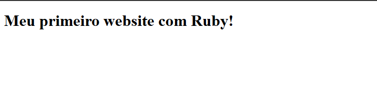

# 🖥️ Meu Primeiro Website em Ruby

Este projeto é uma **página simples** desenvolvida em Ruby, apenas com um texto, com o objetivo de conhecer e experimentar a linguagem. Foi utilizado o framework **Sinatra** para configurar o servidor e servir a página HTML.

---

## 📸 Pré-visualização

  

---

## 🛠️ Tecnologias Utilizadas

- **Linguagem**: Ruby
- **Framework**: Sinatra

---

## Detalhes do Projeto

- É uma página web básica, exibindo um texto simples em HTML.
- Desenvolvido para entender o básico da linguagem Ruby e da estrutura de uma aplicação web com Sinatra.
- **Observação**: Por algum motivo, esta aplicação não roda na **Vercel**.

---

📚 *Projeto desenvolvido para iniciar os estudos com Ruby e aprender sobre configuração de servidores básicos com Sinatra.*
